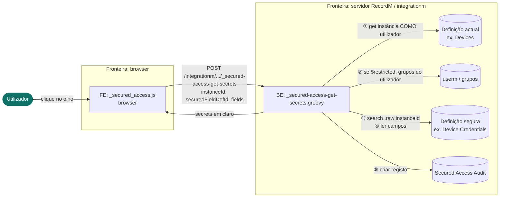

# Pré-leitura 1 de 2 — Briefing: como funciona o `$securedAccess()`

> **Ler antes da reunião de modelação de ameaças** (~10 min). Objectivo: chegar à sessão com o mesmo modelo mental do sistema, para que os 60m sejam gastos a caçar ameaças e não a explicar a feature. A pré-leitura 2 (`02-respostas-tecnicas-secured-access.md`) responde por escrito às seis dúvidas técnicas — leia as duas.

## O que é

`$securedAccess()` apresenta, dentro de uma instância, valores que vivem numa **definição separada com acesso controlado**, sem os duplicar na instância que os mostra. Os valores aparecem **mascarados** (`************`) e só são obtidos do servidor quando o utilizador carrega no ícone do olho; **cada revelação é registada** numa definição de auditoria.

Referência funcional (para quem não conhece a keyword): `pt/01_admins/00_admin-tutorials/01_recordm-creating-information-structures/11_customizations-keywords/14_secured-access.md`, com o exemplo `Devices` / `Device Credentials`.

Regra a ter presente desde já: **`$securedAccess()` é um mecanismo de mascaramento e de auditoria, não uma barreira de acesso na instância que apresenta os valores.** Quem consegue abrir a instância e passar os controlos existentes consegue revelar. A sessão vai testar exactamente *quais* são esses controlos e se se aguentam.

## As peças

A funcionalidade é implementada por **dois ficheiros**, mais duas definições RecordM:

| Peça | Papel |
| --- | --- |
| **FE — customização `_secured_access.js`** | Corre no browser (`cob.custom.customize`). Desenha o bloco seguro, mascara os campos, injecta o botão de revelar e, ao clique, chama o endpoint. |
| **BE — script integrationm `_secured-access-get-secrets.groovy`** | Endpoint `POST /integrationm/concurrent/_secured-access-get-secrets`. Faz o controlo de acesso, resolve a instância segura, devolve os valores em claro e escreve a auditoria. |
| **Definição actual** (ex.: `Devices`) | Onde o grupo `$securedAccess()` está declarado. Nunca guarda os valores sensíveis. |
| **Definição segura** (ex.: `Device Credentials`) | Onde os valores realmente vivem. Tem o campo de referência (ex.: `Device`) que aponta de volta para a definição actual. |
| **Definição de auditoria** (`Secured Access Audit`) | Um registo por revelação: data, utilizador, instância, instância segura, definição e campos acedidos. |

## Os três fluxos

### 1. Configuração (tempo de admin)
Um modelador declara, na definição actual, um campo `$group` com `$securedAccess(<definição segura>, <campo de referência>)` e, sob ele, campos com `$securedInfo(<campo remoto>)`. Nenhum valor sensível é escrito aqui.

### 2. Apresentação (abrir a instância)
O FE encontra o grupo seguro e, **sem contactar o servidor para obter segredos**, substitui cada campo por uma caixa de leitura com `************` e acrescenta o botão do olho. Em instância nova ou em edição de grupo, mostra apenas "não disponível". **Nenhum valor em claro é enviado nesta fase.**

### 3. Revelação (clique no olho) — o fluxo crítico
```
Utilizador  ──clique no olho──▶  FE
   FE  ──POST {instanceId, securedFieldDefId, fields}──▶  BE (endpoint integrationm)
      BE ① lê a instância de origem COMO o utilizador ......... 403 ⇒ pára
      BE ② se o grupo tem $restricted, verifica os grupos do utilizador ... falha ⇒ pára
      BE ③ procura na definição segura a instância cujo campo de referência = instanceId
      BE ④ lê os campos pedidos dessa instância segura
      BE ⑤ escreve o registo de auditoria
   BE  ──{secrets}──▶  FE
   FE coloca os valores nas caixas e troca o olho para "aberto"
```
Novo clique esconde os valores e repõe `************` (o valor já esteve no DOM).

## DFD — fluxo de revelação



**Nota de leitura do diagrama:** os passos ① e ② correm **no contexto do utilizador**; reparar que ③/④ (a leitura da definição segura) e ⑤ (a auditoria) — ver a pré-leitura 2 — não passam esse contexto. É um dos pontos que a sessão vai discutir.

## Componentes, actores e fronteiras (resumo para a secção 2 da agenda)

- **Componentes:** FE (bloco seguro, botão de revelar); BE (controlo de acesso, resolução pelo campo de referência, endpoint de revelação); definição actual; definição segura; motor de permissões / grupos; registo de auditoria; índice de pesquisa.
- **Actores:** utilizador que consulta a instância; utilizador que revela; admin/modelador que declara as keywords; consumidores de API/integrações que chamem o endpoint directamente; auditor.
- **Fronteiras de confiança:** browser ↔ servidor; permissões da definição actual **vs.** da definição segura; estado mascarado **vs.** revelado; tempo de configuração (admin) **vs.** tempo de execução (utilizador).

## O que trazer para a sessão

1. Ter lido a pré-leitura 2 (respostas às seis dúvidas) — é aí que estão os detalhes que mudam a avaliação de risco.
2. Pensar, por categoria STRIDE, em "como faria eu para ver um valor que não devia" e "como faria para revelar sem deixar rasto".
3. O `$securedAccess()` protege **mascaramento + auditoria**, não o acesso — validar se os controlos de acesso que *existem* (passos ① e ②) chegam para o que a documentação promete.
